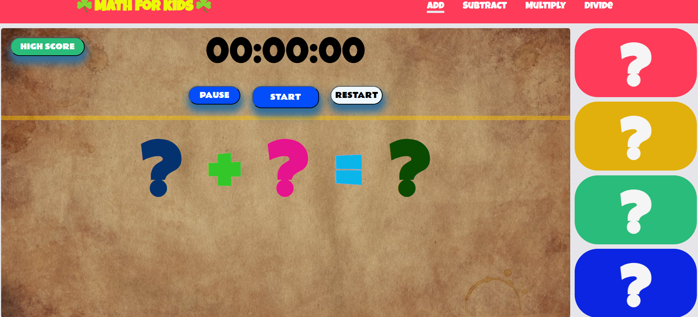
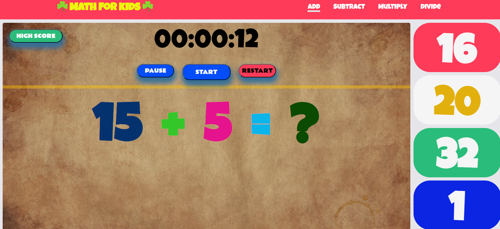
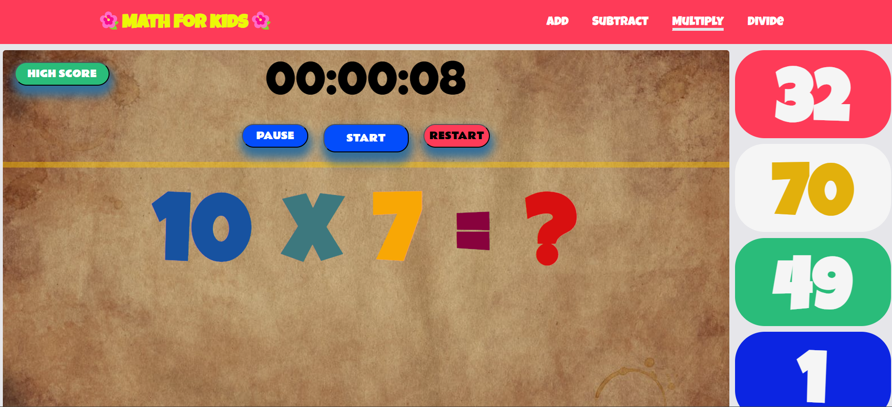

# Math for Kids

This application is a simple math quiz game that allows users to solve mathematical operations, keeping track of their progress using a timer and a scoring system stored in the `localStorage`.

## Features

1. **Mathematical Operations**:

   - The app presents random mathematical problems (addition, subtraction, multiplication, division).
   - Users can input answers directly and receive feedback on correctness.

2. **Timer**:

   - The app includes a countdown timer that challenges users to solve as many problems as possible within a set time limit.
   - When the timer expires, the game stops, and the user's score is displayed.

3. **Scoring System**:

   - Each correct answer adds points to the user's score.
   - The score is stored in `localStorage` so that it remains available even after refreshing the page or closing the app.

4. **Leaderboard**:
   - The app keeps a list of top scores from previous games.
   - The leaderboard is dynamically updated, and scores are fetched from `localStorage`.

## Technologies Used

- **HTML**: Structure of the app and quiz interface.
- **CSS**: Styling for the quiz, timer, and leaderboard.
- **JavaScript**: Core logic for generating problems, handling user input, managing the timer, and interacting with `localStorage`.

## How to Use

1. Start the quiz by pressing the "Start" button.
2. Solve as many problems as you can before the timer runs out.
3. When the game ends, your score will be displayed and saved in `localStorage`.
4. You can view your best scores on the leaderboard.

